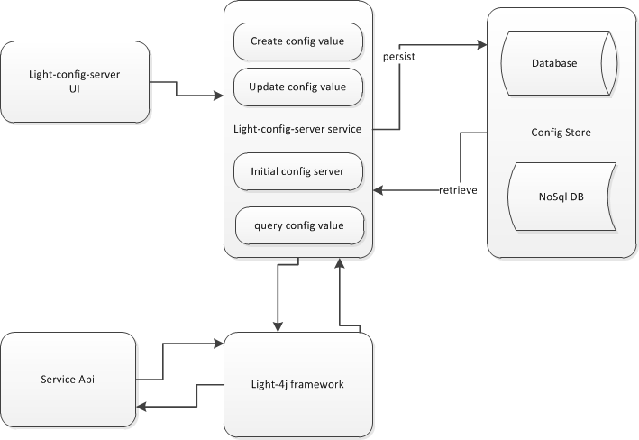

# Light Config Server


### Service build as Light Hybrid 4J Service

This project is  developed as light-hybrid-4j services.  To deploy your service, just drop
the jar into a directory and start light-hybrid-4j server.


### Config Server


Services built on the light platform are composed with many plugins as part of the embedded gateway, and each plugin(or middleware handler)
has its configuration file to control if they are enabled and the runtime behavior.
Developers usually are don’t need to worry about these config files as these can be added later on by operation team.


Unlike other application frameworks, we are not using a single config file but multiple config files as each service decides which plugins should be utilized and how they are utilized.


When managing the configurations, the following things need to be considered:


-- Multiple config template files per service.

-- Every environment has some values different.

-- Some sensitive values need to be encrypted.

-- Some of the config files need to be merged from several organizations.

-- Some of the config files need to be overwritten from several organizations.

-- When config server is used, there should b minimum internal config files to ensure the connectivity to the config server


### Config Value data format

The config value will be save into database (NoSql DB or RDBMS DB). The config value will have two type entries:

-- Service specific config value(identify by service Id)

-- Common config value, which is same for all services in the environment.


From config value key, system identify the template and and config name in the confgi template file.

For example:

config key:  service/javax.sql.DataSource/com.zaxxer.hikari.HikariDataSource/DriverClassName

It will identify following config in the service.yml file (template):

javax.sql.DataSource
  com.zaxxer.hikari.HikariDataSource
    DriverClassName


### Workflow diagram





### Config value security

-- Some sensitive values need to be encrypted

 When the light-config-server hybrid service started, system will create an encrpt/decrpt key file on the files system (by default will be in the user home folder).

 File name:  light-config-server.conf


 System admin should trigger the Initial server service first after light-config-server service start to run to set the encrpt/decrpt key into the key file ( light-config-server.conf)


### Verify the config server

1. Build the config server module

```
cd ~/networknt/light-config-server
git pull origin develop
mvn clean install

```

2. Build Hybrid-command from light-portal

```
cd ~/networknt/light-portal
git pull origin develop
mvn clean install

```

3. Copy the Hybrid service required jar files for light-docker

```
cd ~/networknt/light-docker
git pull origin develop
cp ~/networknt/light-config-server/target/config-server-1.5.19.jar ~/networknt/light-docker/hybrid-services/service
cp ~/networknt/light-portal/hybrid-command/target/hybrid-command.jar ~/networknt/light-docker/hybrid-services/service

```

4. Start hybrid service from light-docker

```
cd ~/networknt/light-docker
docker-compose -f docker-compose-hybrid-service.yml up

```


5. Test create service:

```
POST /api/json HTTP/1.1
Host: localhost:8443
Content-Type: application/json
Cache-Control: no-cache
{"host":"lightapi.net","service":"config","action":"create-service","version":"0.1.0","data":{"serviceId":"config-service-1.1.0001","encryptionAlgorithm":"AES","templateRepository":"git@github.com:networknt/light-config-server.git","serviceOwner":"Google","version":"1.1.1","profile":"DEV/DIT","refreshed":false}}


```

The create service request return the generated config service Id, for example:  0000016543342c47-0242ac1300050000.

Use the generated config service Id for the following tests;


6. Test create config server value: key-value pair:

```
POST /api/json HTTP/1.1
Host: localhost:8443
Content-Type: application/json
Cache-Control: no-cache
{"host":"lightapi.net","service":"config","action":"create-service-value","version":"0.1.0","data":{"configServiceId":"0000016543342c47-0242ac1300050000","key":"server/serviceId","value":"1222222"}}

```


7. Test config server values: key-value pair array:

```
POST /api/json HTTP/1.1
Host: localhost:8443
Content-Type: application/json
Cache-Control: no-cache
{"host":"lightapi.net","service":"config","action":"create-service-values","version":"0.1.0","data":{"configServiceId":"0000016543342c47-0242ac1300050000","values":[{"key":"server/enableHttps","value":"true"}, {"key":"server/httpsPort","value":"true"}]}}

```

8. update service:

```
POST /api/json HTTP/1.1
Host: localhost:8443
Content-Type: application/json
Cache-Control: no-cache
 {"host":"lightapi.net","service":"config","action":"update-service","version":"0.1.0","data":{"serviceId":"config-service-1.1.0001","encryptionAlgorithm":"AES","templateRepository":"https://github.com/chenyan71/light-config-template.git","serviceOwner":"networknt","version":"1.1.1","profile":"DEV/DIT","refreshed":false}}

```


9. update config value:

```
POST /api/json HTTP/1.1
Host: localhost:8443
Content-Type: application/json
Cache-Control: no-cache
{"host":"lightapi.net","service":"config","action":"update-service-value","version":"0.1.0","data":{"configServiceId":"0000016543342c47-0242ac1300050000","key":"enableJwtCache","value":"false"}}

```

10. query  service:

```
POST /api/json HTTP/1.1
Host: localhost:8443
Content-Type: application/json
Cache-Control: no-cache
{"host":"lightapi.net","service":"config","action":"query-service","version":"0.1.0","data":{"serviceId":"config-service-1.1.0001","profile":"DEV/DIT","version":"1.1.1"}}

```

10. query  config value by specified service id and key:

```
POST /api/json HTTP/1.1
Host: localhost:8443
Content-Type: application/json
Cache-Control: no-cache
\{“host":"lightapi.net","service":"config","action":"query-service-value","version":"0.1.0","data":{"configServiceId":"0000016543342c47-0242ac1300050000","key":"enableJwtCache"}}

```


11. query  config values (config value key-pair list for specified service):

```
POST /api/json HTTP/1.1
Host: localhost:8443
Content-Type: application/json
Cache-Control: no-cache
 {"host":"lightapi.net","service":"config","action":"query-service-values","version":"0.1.0","data":{"configServiceId":"0000016543342c47-0242ac1300050000"}}

```


12. delete service:

```
POST /api/json HTTP/1.1
Host: localhost:8443
Content-Type: application/json
Cache-Control: no-cache
{"host":"lightapi.net","service":"config","action":"delete-service","version":"0.1.0","data":{"serviceId":"config-service-1.1,1","encryptionAlgorithm":"AES","templateRepository":"git@github.com:networknt/light-config-server.git","version":"1.1.1","profile":"DEV/DIT","refreshed":false}}

```


13.delete config value by specified service id and key:

```
POST /api/json HTTP/1.1
Host: localhost:8443
Content-Type: application/json
Cache-Control: no-cache
{"host":"lightapi.net","service":"config","action":"delete-service-value","version":"0.1.0","data":{"configServiceId":"0000016543342c47-0242ac1300050000","key":"testUser"}}

```


14.delete config values:

```
POST /api/json HTTP/1.1
Host: localhost:8443
Content-Type: application/json
Cache-Control: no-cache
{"host":"lightapi.net","service":"config","action":"delete-service-values","version":"0.1.0","data":{"configServiceId":"0000016543342c47-0242ac1300050000"}}

```

15.retrieve config values (config.zip file):

```
POST /api/json HTTP/1.1
Host: localhost:8443
Content-Type: application/json
Cache-Control: no-cache
{"host":"lightapi.net","service":"config","action":"retrieve-config","version":"0.1.0","data":{"serviceId":"config-service-1.1.0001","profile":"DEV/DIT","version":"1.1.1"}}

```